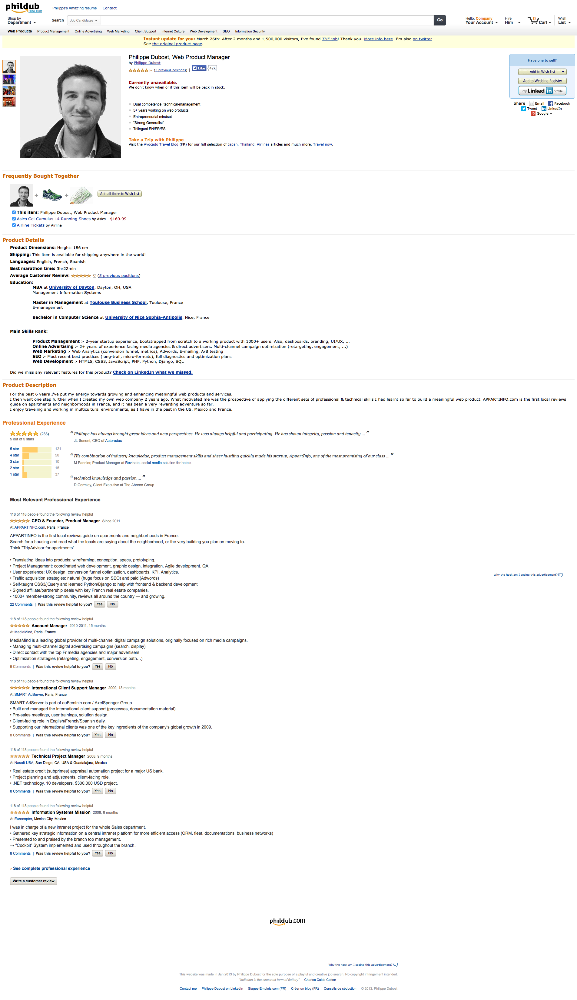
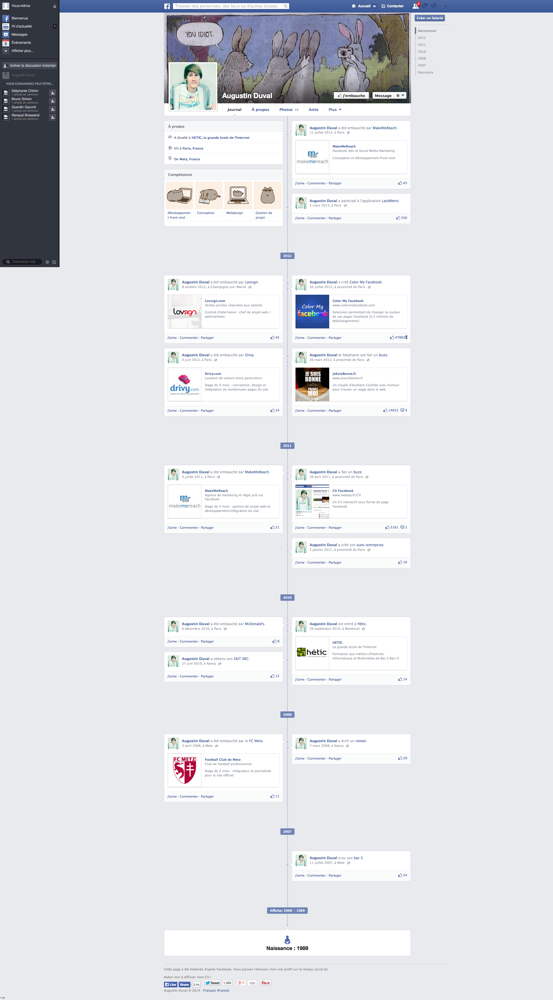
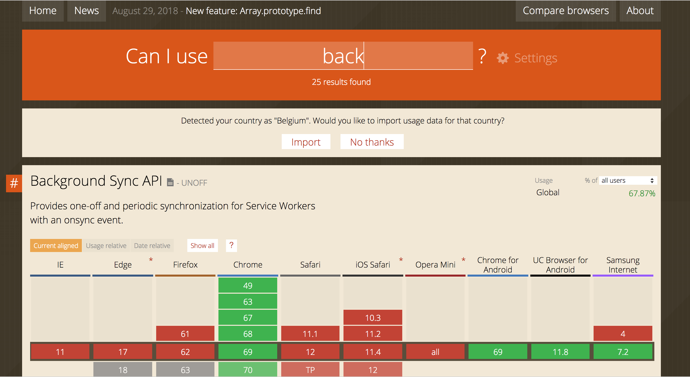
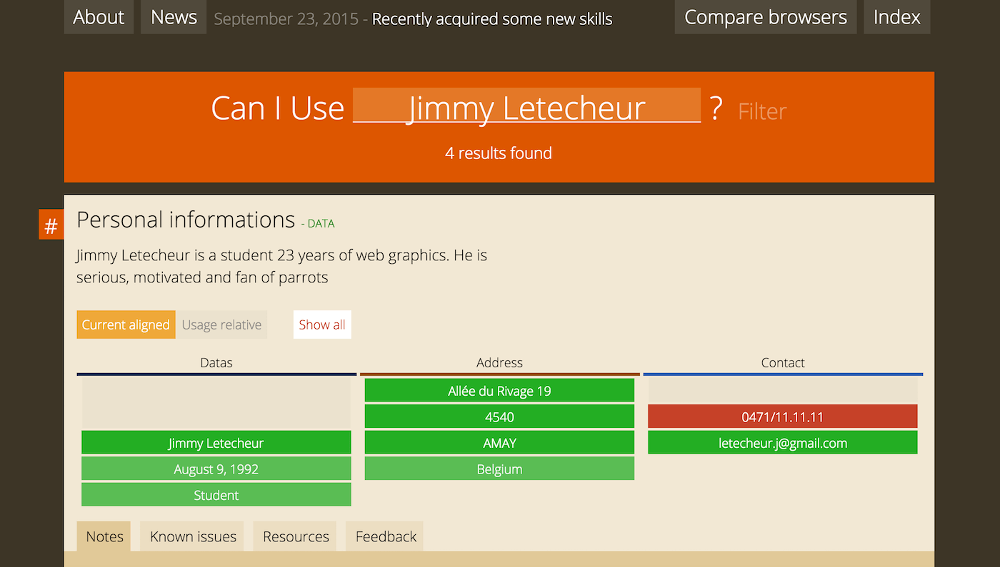
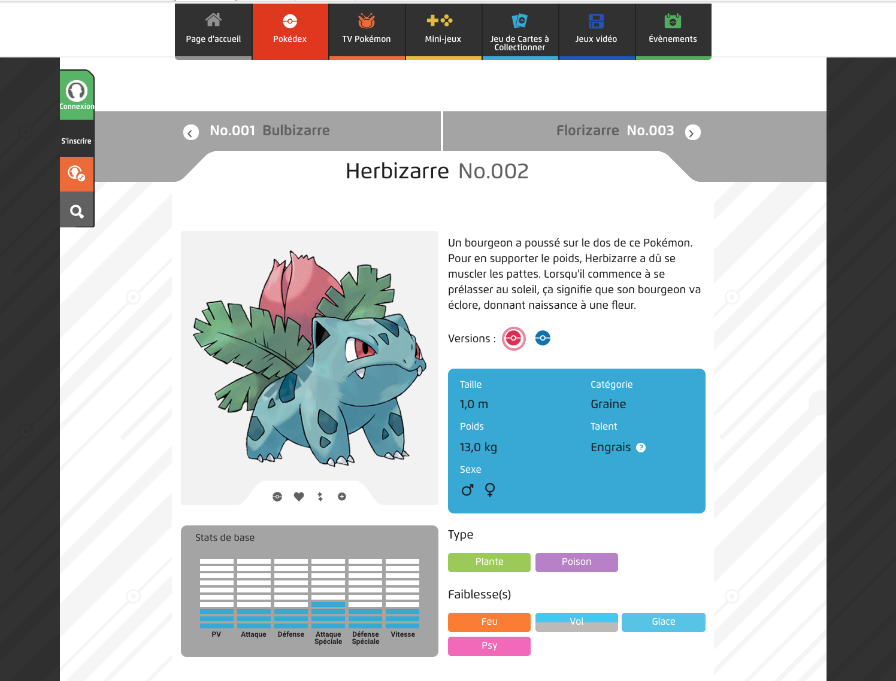
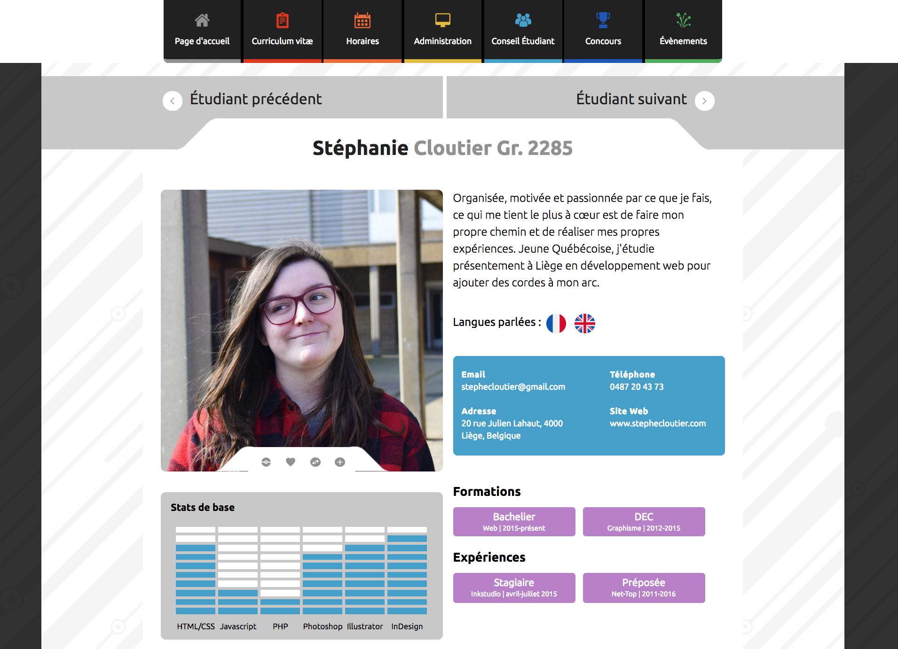

# PROJET 1 : votre CV

## Cahier des charges

Réalisez un CV qui suit un canevas connu, par exemple :

- une page produit amazon (ou Sarenza, ou Pixmania, …)
    
- une page facebook
    
- une offre groupon
    
- une page produit sur Apple
- une page linkedin
- une page ebay
- une fiche de jeux vidéo (par exemple sur jeuxvideo.com)
- la page d'un acteur ou d'un réalisateur sur IMDb
- une page d'artiste sur Deezer
- la fiche d'une série sur Beta-series
- un vol Ryanair
- une offre pour un domaine CenterParcs
- la page « à propos » d'Ethias
- l'annonce d'un programme sur rtbf.be
- un article sur le soir.be
- une petite annonce sur Immovlan ou Immoweb

Le layout devra reproduire le plus fidèlement possible le design du site original.

Le HTML et le CSS devront être personnels et adaptés :

- HTML5 sémantique, valide, accessible, microdatas utiles ;
- CSS responsive (design élastique, une version moblile et une version desktop).

## Les consignes et réalisations par d’anciens étudiants

### Selon Jimmy Letecheur (2015-2016)

J'ai du réaliser pour le cours de design web un CV sur base d'un site web existant. J'ai choisi le célèbre Can I Use.

- [CanIUse, le site original dont est inspiré le CV](https://caniuse.com/)
- [le CV](https://letecheur.me/projets/caniuse/)
- [la page du pojet sur son portfolio](https://letecheur.me/cv-can-i-use/)
- [le portfolio de Jimmy](http://letecheur.me) 
- [Le PFE de Jimmy](http://ecoleinfographie.be). Vous pouvez aussi tester l’interface d’administration en vous rendant à l’adresse suivante et en vous créant un compte : http://ecoleinfographie.be/admin

### Selon Stéphanie Cloutier (2016-2017)

Le CV a été notre premier projet pour le cours de Design Web. Le but était de copier la page d’un site web, pour ma part celle d’une fiche de Pokémon du site du même nom. Par la suite, nous devions remplir la page avec nos informations comme s’il s’agissait de notre CV.

- [Pokemon, le site original dont est inspiré le CV](https://www.pokemon.com/fr/pokedex/herbizarre)
- [le CV](http://stephanie.cloutier.pro/cv/)
- [la page du pojet sur son portfolio](http://stephanie.cloutier.pro/project/cv/) 
- [le portfolio de Stéphanie](http://stephanie.cloutier.pro)

### Selon Képhren Simonis (2016-2017)

Le but de l’exercice était de copier le canvas d’un site existant en y intégrant nos informations personnelles pour en faire notre CV. Il n’est pas question ici de copier le code et de modifier les informations. Il faut analyser le site, essayer de comprendre comment sont codés les différents éléments et enfin créer sont propre code et appliquer l’analyse préalable du site officiel pour que notre CV y ressemble comme 2 gouttes d’eau.

- Képhren Simonis
    - [Portfolio de Képhren Simonis](http://hepl01.cblue.be/~user19/dw/portfoliowp)
    - [page du pojet sur portfolio](http://hepl01.cblue.be/~user19/dw/portfoliowp/projets/cv-skype/)
    - [CV](http://hepl01.cblue.be/~user19/dw/cv/)
    - [Skype, site original dont est inspiré le CV](https://www.skype.com/fr/) N.B. : il a changé…

### Selon Charlotte Toussaint (2017-2018)

- Charlotte Toussaint
    - [CV](http://hepl01.cblue.be/~user124/dw_sept/cvjuin/)
    - [BlablaCar, site original dont est inspiré le CV]() : N.B. Le design du site a beaucoup changé => copie d'écran

### Selon Gilles Delmotte (2017-2018)

- Gilles Delmotte
    - [CV](http://hepl01.cblue.be/~user120/dw/cv/)
    - [Dribbble, site original dont est inspiré le CV](https://dribbble.com/)

### Selon Cédric Müller (2017-2018)

- [page du pojet sur le portfolio](https://www.mullercedric.com/projets/cv-sous-la-forme-dun-site-existant/)
- [CV](https://www.mullercedric.com/cv/)
- [Encyclopédie de Harry Potter](https://www.encyclopedie-hp.org/monde-magique/sorciers/cedric-diggory/) : Choisir une encyclopédie comme référence n'est pas anodin. En effet, je me suis dit qu'il serait facile d'intégrer mes informations sur un site donc le but premier est de donner des informations sur des personnages, des lieux, etc. Appréciant l'univers d'Harry Potter, je me suis naturellement dirigé vers une encyclopédie de cet univers. Avec du recul, je me suis rendu compte de beaucoup de petit problème que je n'avais pas remarqué lors de mon choix. Ca faisait donc également partie de mon travail d'en corriger une partie (réduire le nombre de couleurs utilisées, rendre le code valide, etc.)

### Selon Pauline Viroux

La consigne était de réaliser notre CV en reprenant le design d’un site connu. J’ai choisi le site de voyage Travelbird.

J’ai intégré mon CV dans une de leur page « produit ». Le travail n’était pas tellement difficile, le tout était de bien analyser chaque élément de la page afin de le reproduire au détail près.

### Selon Anne Remacle

Le but était de réaliser notre CV en copiant le design d’un site connu du grand public idéalement. Grosso modo, fallait pas aller chercher le petit site d’un tailleur de pierres du fin fond de la Nouvelle-Zélande (j’exagère, bien entendu).

Après quelques recherches en fonction des exemples proposés par notre prof et un peu de réflexion, j’ai choisi Linkedin. Oui OK, c’est déjà un site où on montre son cv, mais le notre ne devait pas être présenté de la même façon. Et j’apprécie le design de ce site qui est simple, mais très efficace.

Pour commencer, il faut un contenu. Du coup, création du squelette de mon cv en HTML et sélection des informations pertinentes et moins pertinentes. Après ça, il a fallu récupérer les différentes couleurs et les polices utilisées sur le site histoire d’avoir un design le plus fidèle possible par rapport à l’original. Et paf ! C’était le moment de passer au CSS !

Ce ne fut pas une tâche facile de coller au design original, mais grâce aux extensions ajoutées à mes différents navigateurs, j’ai été capable de récupérer les différentes mesures nécessaires et pour un premier vrai projet, je suis plutôt contente du résultat.

## Exemples

### Réalisations d’anciens étudiants :

### 2017-2018

#### Autres

- Marvin Lemarchand : 
    - http://hepl01.cblue.be/~user121/cv/
    - https://www.leforem.be/
- Félix Gason (pas bien, trop pauvre) :
    - [page du pojet sur le portfolio](http://felixgason.com/projets/cv/) : Le but du projet de CV était de reprendre le layout ainsi que le style d'un site web connu, puis d'y remplacer les informations avec le contenu de notre CV.  
    - [CV](http://felixgason.com/cv/)

### 2015-2016 :

#### Autres 

- Pauline Viroux
    - [Portfolio de Pauline Viroux](http://www.paulineviroux.be)
    - [page du pojet sur portfolio](http://paulineviroux.be/project/travelbird-cv/)
    - [CV](http://www.paulineviroux.be/cv/)
    - [Travelbird, site original dont est inspiré le CV]() : 
- Anne Remacle
    - [Portfolio de Anne Remacle](http://anne-remacle.be)
    - [page du pojet sur portfolio](http://anne-remacle.be/project/projet-cv-linkedin/)
    - [CV](http://projets.anne-remacle.be/cv/)
    - [site original dont est inspiré le CV]()
-  Dylan Shirino
    -  [Portfolio de Dylan Shirino](http://schirino.be/)
    -  => pas le CV…

### 2016-2017 :

#### TB

- Éric Closquet
    - [Portfolio de Éric Closquet](http://eric-closquet.be)
    - [page du pojet sur portfolio](http://eric-closquet.be/cv-sur-design-existant/)
    - [CV](http://cv.eric-closquet.be/)
    - [site original dont est inspiré le CV]()
- Quentin George
    - [Portfolio de Quentin George]()
    - [page du pojet sur portfolio]()
    - [CV]()
    - [site original dont est inspiré le CV]()

#### Autres

- Gabriel Martinez
- [Portfolio de Gabriel Martinez](http://martinz.be) 
- [page du pojet sur portfolio](http://martinz.be/#section-projects) 
- [CV](http://hepl01.cblue.be/~user30/dw/cv/)
- [Google, site original dont est inspiré le CV]()
- Maxime Scibetta
- [Portfolio de Maxime Scibetta](http://maxime-scibetta.be)
- [page du pojet sur portfolio]()
- [CV](http://maxime-scibetta.be/cv/)
- [Netflix, site original dont est inspiré le CV]()
- Lucas Gava
- [Portfolio de Lucas Gava](http://lucas-gava.be)
- [page du pojet sur portfolio]()
- [CV]()
- [site original dont est inspiré le CV]()
- Anthony Beaumecker
- [Portfolio de Anthony Beaumecker](http://beaumecker.be)
- [page du pojet sur portfolio]() 
- [CV]()
- [site original dont est inspiré le CV]()
- Mehdy Ouras el ouad
- [Portfolio de Mehdy Ouras el ouad](http://mehdy.ouras.be/portfolio)
- [page du pojet sur portfolio]()
- [CV]()
- [site original dont est inspiré le CV]()

Mariam Faso : 
- https://maxime-scibetta.be/mariamfaso/pourquoi-faire-un-don/

